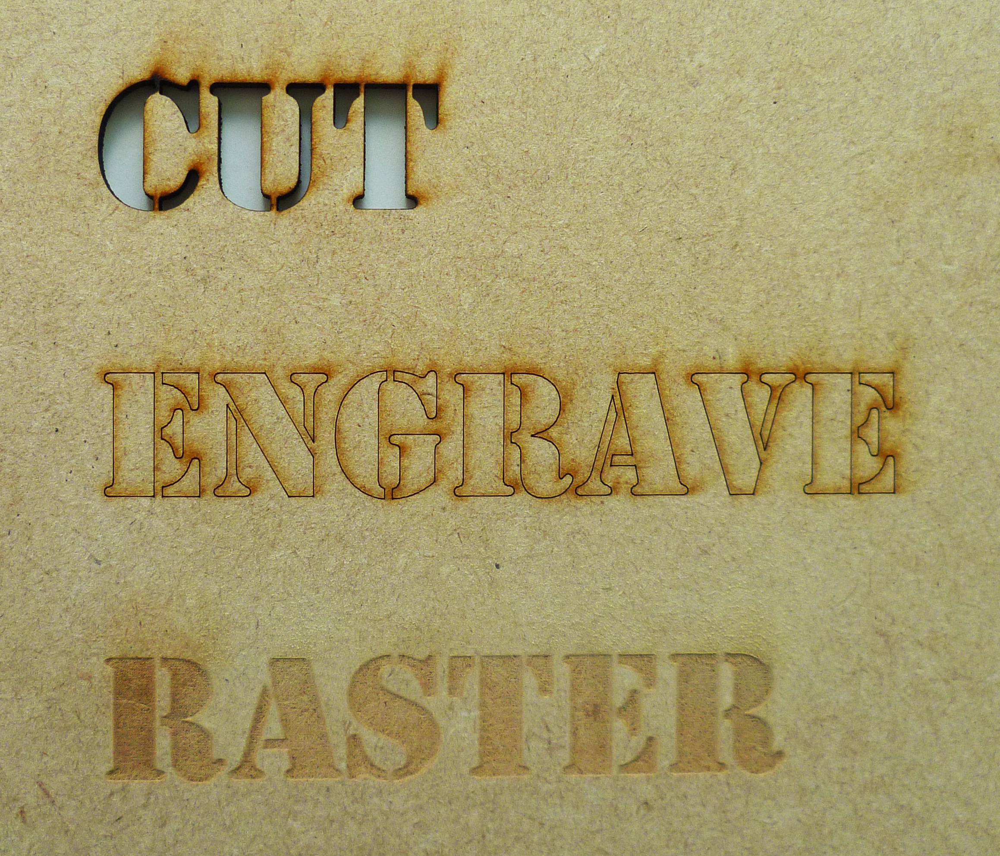

# Disegno 2D per il taglio laser

<iframe src="https://giphy.com/embed/Qkl1UW26bl5Sg" width="100%" height="100%" style="position:absolute" frameBorder="0" class="giphy-embed" allowFullScreen></iframe>

<blockquote class="imgur-embed-pub" lang="en" data-id="YLvvDEd"><a href="//imgur.com/YLvvDEd">100 Watt Laser Cutting Paper</a></blockquote>

## Possibilità realizzative: incisione, raster, taglio

L'incisione, il raster e il taglio sono lavorazioni che avvengono prevalentemente a partire da file 2D, tracciati o immagini.
Per questo è consigliato l'utilizzo di software di grafica (o al massimo di modellazione) per la realizzazione dei progetti.

**I software consigliati:**

**Incisione:**

- Illustrator
- Inkscape
- Rhinoceros

**Raster:**

- Photoshop
- Illustrator
- Inkscape

**Taglio:**

- Illustrator
- Inkscape
- Fusion360

### I livelli
Per agevolare il lavoro è consigliato suddividere i tracciati in layer in base al colore assegnato a ciascuna lavorazione.
I livelli vanno inoltre ordinati per priorità di lavorazione:

- **Incisione**
- **taglio interno**
- **taglio esterno**

**L’incisione** (come il raster) è considerata l’operazione preliminare poiché non causa eventuali spostamenti del materiale sul piatto di lavoro.
**Il taglio interno** è l’operazione secondaria, riferita solitamente ai dettagli, che precede quella di ritaglio del pezzo **(taglio esterno)**.

