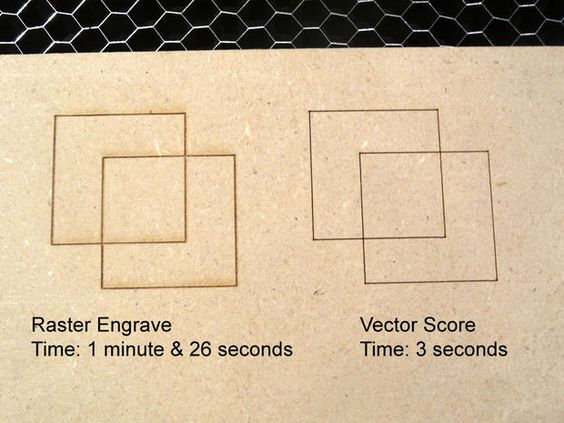
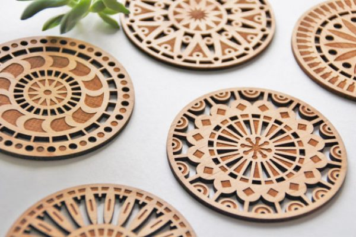
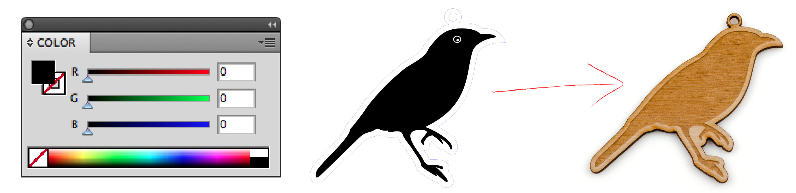
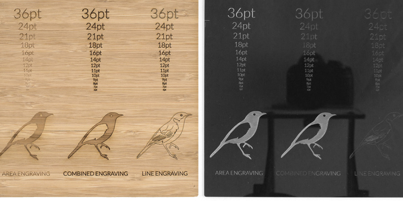

# Il raster
 

<iframe src="https://giphy.com/embed/ToDGsP64HbY0U" width="100%" height="100%" style="position:absolute" frameBorder="0" class="giphy-embed" allowFullScreen></iframe>

 
 
 
 
Si utilizza il laser anche per riprodurre tracciati (silhouette e campiture) e immagini bitmap lavorando in modalità raster.
Il laser in questo caso modula la potenza in base alla luminosità di ogni pixel presente nella bitmap.
E’ una lavorazione che solitamente impiega più tempo di una incisione poiché il laser non tiene conto del percorso del tracciato ma procede orizzontalmente da sinistra verso destra come se stesse stampando, per tutta l'area occupata dal disegno.

  

Utilizzando il raster su vari materiali, è possibile produrre una moltitudine di effetti diversi.
Si utilizza infatti questa tecnica per riprodurre immagini e fotografie, bassorilievi, testi e insegne, codici a barre e QR.

  

E' inoltre possibile giocare con i valori della potenza all'interno di JobControl, per ottenre ulteriori sfumature e gradazioni.
Una potenza elevata ci consente di ottenere un effetto simile al bassorilievo. 
Questo si vede molto bene se utilizziamo il legno.
Con una potenza più bassa possiamo ottenere invece un effetto più leggero e delicato.
Questo effetto risulta molto apprezzato su materiali come la carta, il plexiglass, la pelle, il cuoio e il vetro.

 

  

E’ infine possibile combinare più lavorazioni insieme nello stesso file.
Ad esempio utilizzando insieme **engraving + vector cut** possiamo riprodurre un'immagine con una cornice attorno, oppure conferire maggiore risalto al nostro disegno.

 

### Procedimento

Per riprodurre un’immagine per il taglio laser occorre partire da un'immagine bitmap in bianco e nero o in scala di grigi. 
Si utilizza solitamente un software di grafica come Photoshop o Illustrator per realizzarla.
Il formato di esportazione può essere PDF, JPEG o PNG.
 
- Realizzazione della bitmap in bianco e nero
- Esportazione in PDF
- Invio del file a Job Control
  
 
 
#### Esercitazione pratica:

- Realizzare un bassorilievo a partire da una bitmap
- Realizzare un portachiavi di legno, brandizzato con un testo o un logo utilizzando Adobe Illustrator e le tecniche di incisione e raster.
