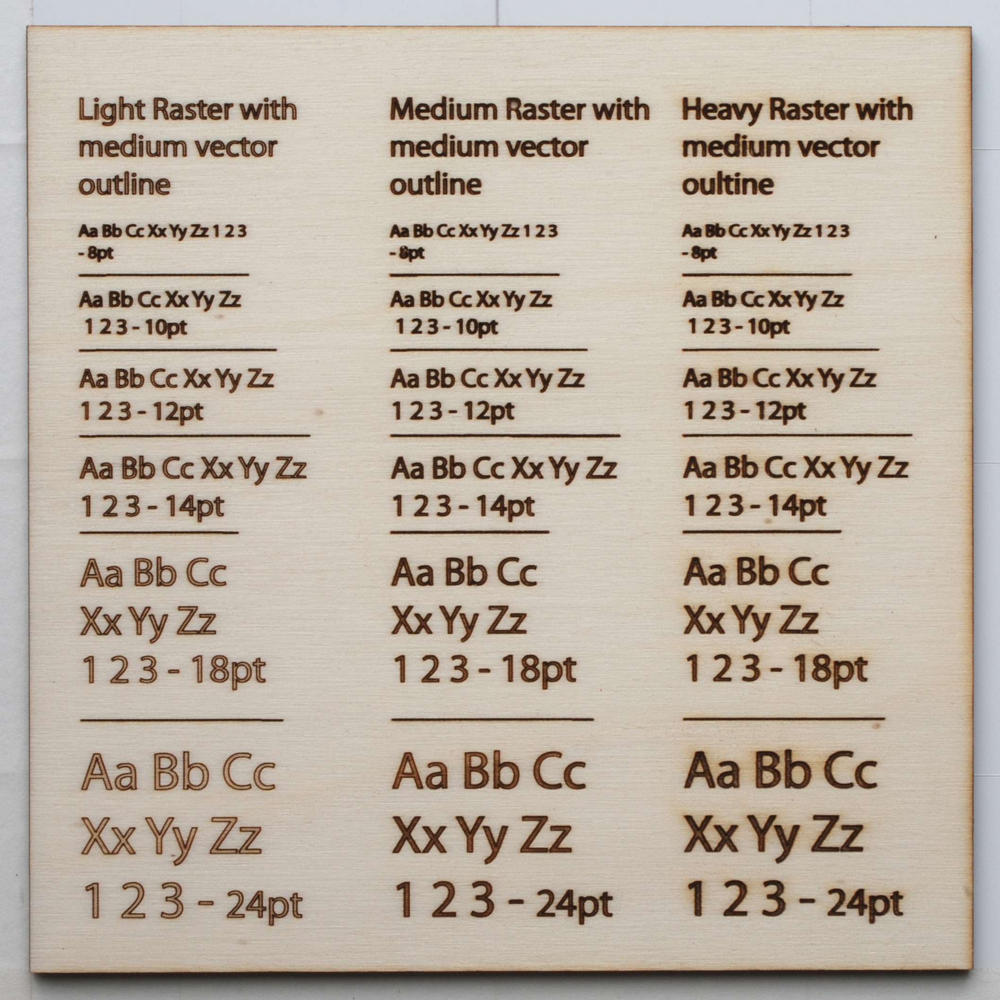

# L'incisione

L’incisione viene effettuata partendo da percorsi (tracciati) 2D.
E’ possibile generare il tracciato con programmi di modellazione 3D come Rhinoceros o di disegno architettonico come Autocad ma per praticità è fortemente consigliato utilizzare un software di disegno 2D vettoriale come Adobe Illustrator o Inkscape.
 

<iframe src="https://giphy.com/embed/1QDku8ioCCo3S" width="100%" height="100%" style="position:absolute" frameBorder="0" class="giphy-embed" allowFullScreen></iframe>

 
### Realizzare un'incisione con Adobe Illustrator

**Il tracciato:**

- Impostare lo spessore della linea a **0.001mm**
- Impostare lo spazio colore del disegno **RGB**
- Impostare il colore dei tracciati blu (0,0,255)
- Convertire il disegno e in uno o più tracciati chiusi
- Eliminare il riempimento, se presente, all'interno del tracciato
- Se presente del testo convertirlo in tracciato **(Menu>Testo>Crea Contorno)** ed espanderlo **(tasto dx: espandi)**
- Eliminare tutte le linee sovrapposte (per vedere se sono presenti altre linee sopravvoste utilizzare il comando **Cmd+Y**)

### Il testo
#### Tip: per evitare la doppia linea in corrispondenza del testo, utilizzare un single line font.

