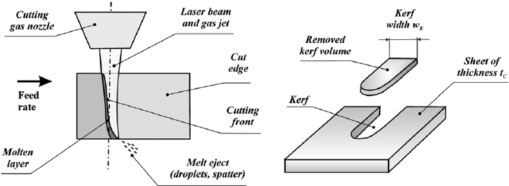
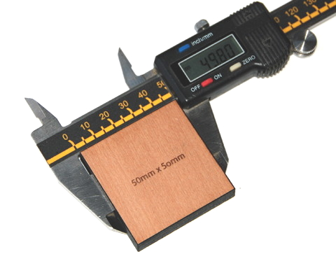
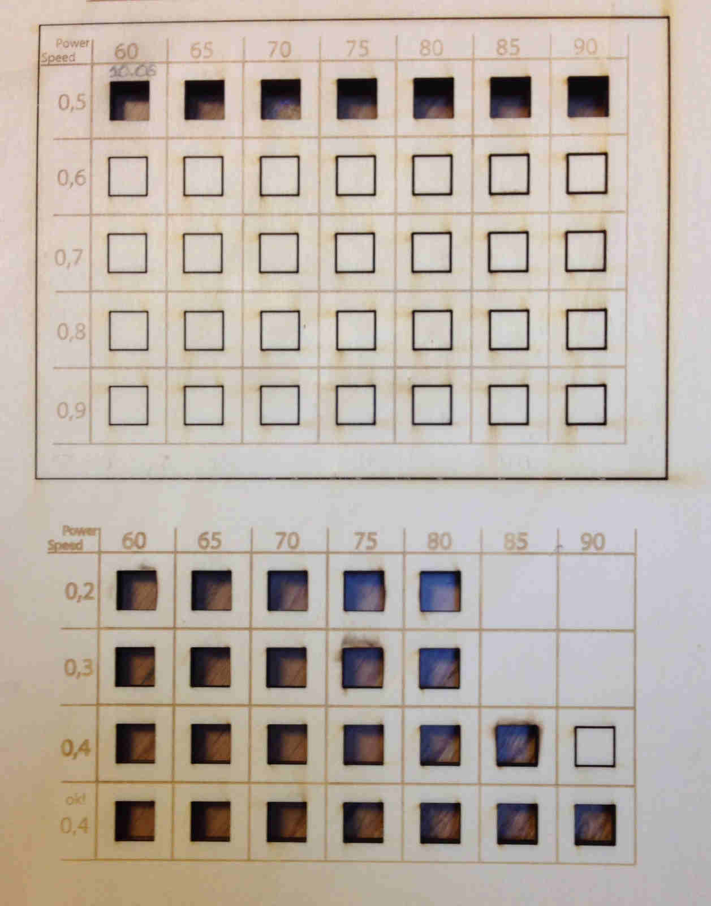
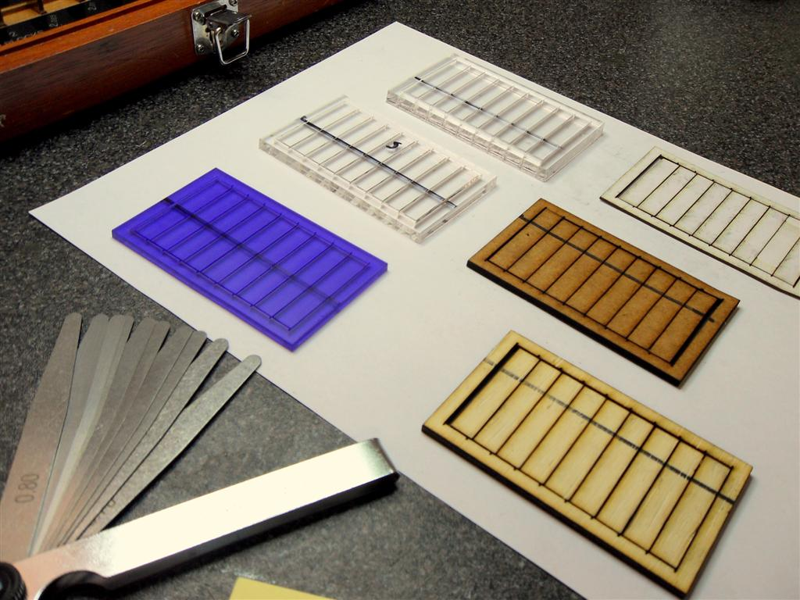

# Il kerf

Il kerf è un concetto chiave per realizzare correttamente progetti con il taglio laser e corrisponde alla quantità di materiale che viene polverizzata e rimossa dal laser durante il taglio.
Solitamente è compreso tra 0.08mm e 1mm e dipende soprattutto dallo spessore e del tipo di materiale che stiamo lavorando. Anche altri fattori tuttavia possono alterare il kerf come la lunghezza focale delle lenti e la pressione dell’aria.

 
 
 
 
Conoscere il kerf di un materiale è importante per realizzare disegni precisi e corretti, fedeli all’originale. Specie se coinvolgono elementi da combinare insieme, come nel caso degli incastri.

 
**Per stimare correttamente il kerf occorre procedere empiricamente.**
 
- Utilizzando un programma di disegno 2D creare un template di riferimento da tagliare a laser.
- Disegnare quindi una serie di quadratini da tagliare con differenti valori di potenza e velocità. 
- Misurare con il calibro i quadratini tagliati e confrontare le misure ottenute con quelle di partenza.
 
La differenza tra le due misure di ogni quadratino (20mm e la misura rilevata) equivale al kerf che dovremmo tenere di conto nel progettazione del nostro disegno, utilizzando quel materiale, quella data potenza e quella data velocità.

In questo modo, osservando il risultato finale, possiamo capire quali settaggi ci permettono di minimizzare il kerf ottenendo un taglio preciso, ottimizzando al tempo stesso i costi e i tempi di lavorazione.

 

 

**Un secondo esempio per misurare il kerf:**

- Disegnare con un programma di disegno 2D un rettangolo e suddividerlo con il comando linea in 9 parti uguali
- Disegnare infine attorno ad esso un altro rettangolo con cui scontorlarlo che farà loro da cornice

Una volta tagliato il disegno, affiancare i 9 rettangoli all'interno dela cornice.
Lo spazio tra la cornice e l'ultimo rettangolo sarà la somma dei kerf delle singole forme.

