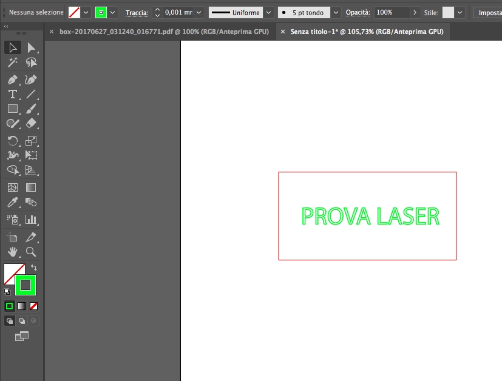

# Il taglio

Il taglio, così come l'incisione, avviene partendo da percorsi (tracciati) 2D.
Ma differisce da quest'ultima nell'utilizzare una potenza molto maggiore.

Il taglio può identificare spesso due lavorazioni distinte: **il taglio interno e il taglio esterno.**

**Il taglio interno** è la prima operazione di taglio che solitamente si riferisce al disegno vero e proprio, alle piccole parti, ai dettagli.

**Il taglio esterno** invece è l'operazione conclusiva che riguarda il ritaglio del pezzo. 

In questa ottica, è opportuno che i tracciati del disegno siano colorati in modo differente.

File di esempio:

### Ordinare i livelli
Per agevolare il lavoro è consigliato suddividere i tracciati in layer in base al colore assegnato a ciascuna lavorazione.
I livelli vanno inoltre ordinati per priorità di lavorazione:
Incisione, taglio interno, taglio esterno.

L’incisione (come il raster) è considerata l’operazione preliminare poiché non causa eventuali spostamenti del materiale sul piatto di lavoro.
Il taglio interno è l’operazione secondaria, riferita solitamente ai dettagli, che precede quella di ritaglio del pezzo.

### Il testo

### Test di taglio
Il consiglio è di realizzare un file di test con una serie di quadratini (10mm) da tagliare a laser con diverse combinazioni per quanto riguarda la potenza e la velocità fino a trovare quella più corretta per un dato materiale.

