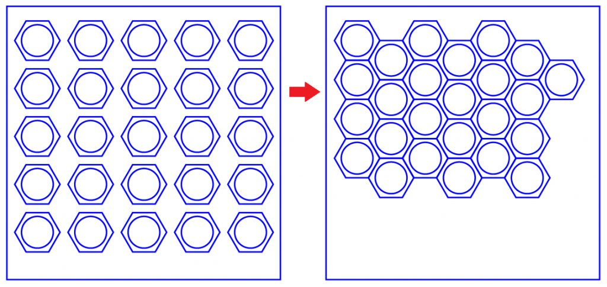

# Il nesting

Il nesting è un passaggio fondamentale per organizzare efficacemente i modelli da tagliare, ottimizzando l’utilizzo del materiale e le tempistiche di lavorazione al momento della messa in tavola.
L’obiettivo è inserire più tracciati possibile da tagliare all’interno dell’area di lavoro riducendo più possibile il tempo.

Il nesting è un'operazione che può essere eseguita manualmente all’interno del software di disegno 2D, oppure in automatico (non raccomandata) mediante appositi software.

### Accorgimenti per ridurre notevolmente i tempi di lavorazione e ottimizzare il materiale:

- Chiudere tutti i tracciati
- Evitare le doppie linee nel disegno 
- Rimuoverne eventuali per risparmiare passaggi aggiuntivi 

**Esempio di un buon nesting**

Progetto del Fab Lab di Seoul

