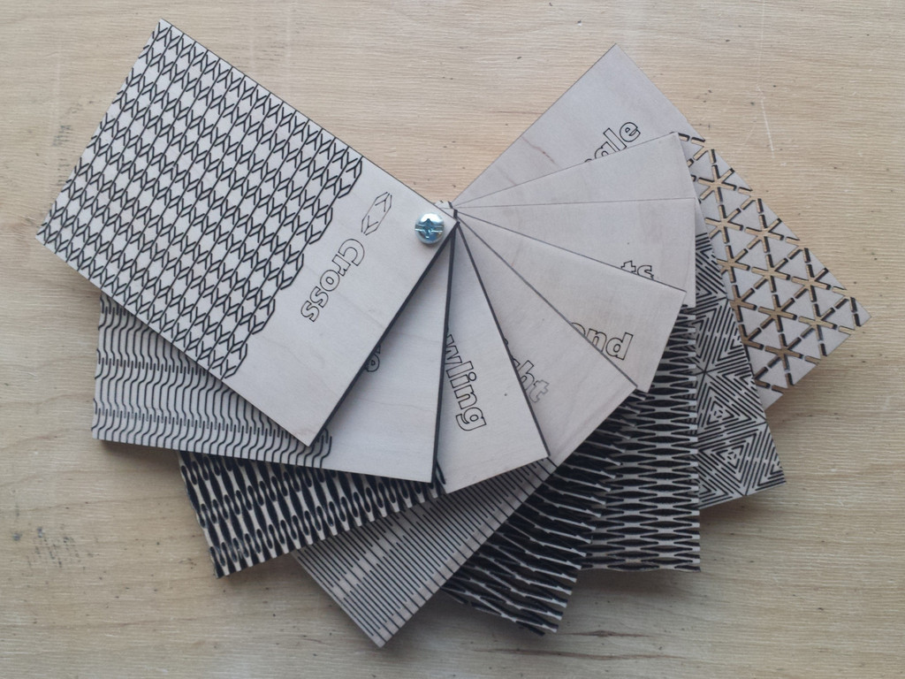
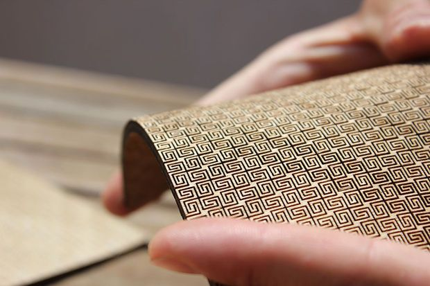
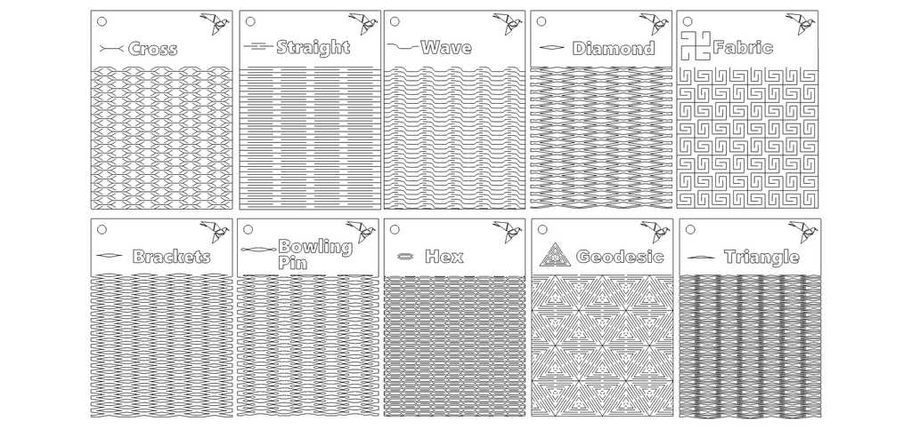
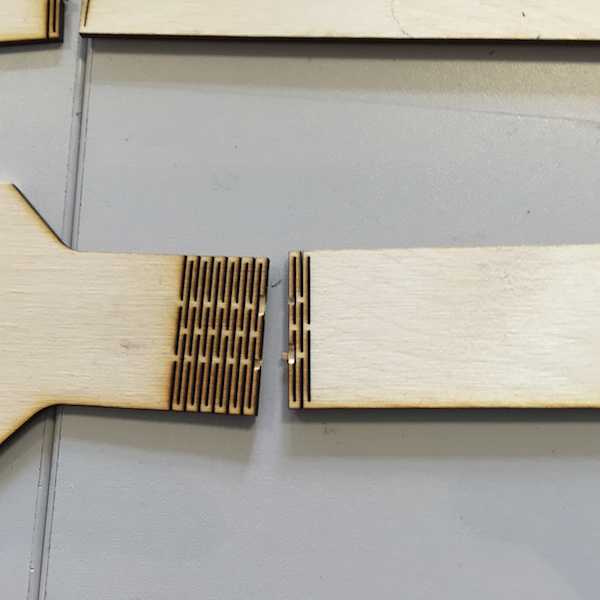
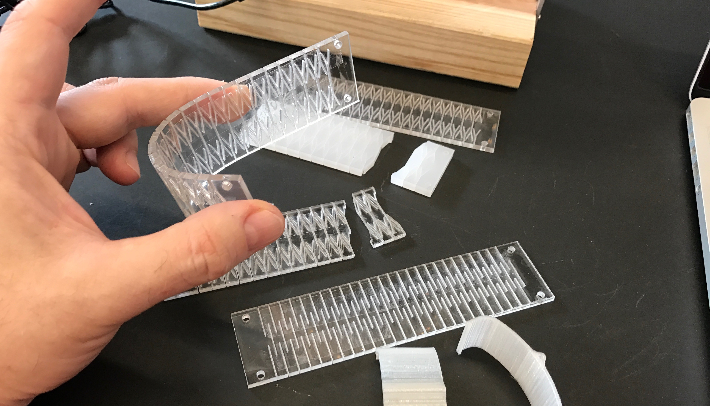
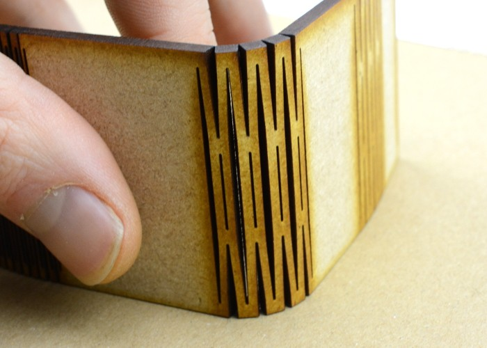

# I living-hinge

Una tecnica per riuscire a curvare materiali rigidi come legno, plexiglass, pelle e cuoio consiste nell’utilizzare i living-hinge, particolari pattern che consentono facilmente di piegare questi materiali in una o più direzione a seconda del disegno che presentano.

 
### I materiali compatibili

I materiali che possono essere curvati con questa tecnica sono i seguenti: 

- Compensato di legno (multistrato)
- Plexiglass fino 
- Pelle
- Cuoio

In base alla lavorazione e al materiale che vogliamo utilizzare dobbiamo scegliere la tipologia più indicata di pattern.
Tenere presente che i pattern ricavati sono molto fragili e possono rompersi facilmente, sia in fase di lavorazoine che in fase di assemblaggio del pezzo.
Inoltre, per materiali molto spessi è raccomandato aumentare il kerf all'interno dei pattern, altrimenti risulterà impossibile piegarli.

### Applicazione del living-hinge

[scarica i pattern living-hinge](http://www.productgraph.io/download-living-hinge-swatches)
 
Per applicare il pattern al nostro progetto occorre incorporare il disegno al nostro tracciato e assegnargli il profilo colore corrispondente alla lavorazione da effettuare.

Nel posizionare il materiale sul tavolo di lavoro del laser, tenere conto (per i materiali organici, in particolare il legno) dell'orinetamento e la disposizione delle fibre.

**Prestare attenzione alla potenza durante la lavorazione a laser dei pattern:**

- Spesso accade di utilizzare una potenza di taglio troppo elevata e alcuni pattern che presentano una trama più delicata di altri, dove le linee di taglio sono molto vicine, possono facilmente rompersi durante la lavorazione.

**Scegliere il pattern in funzione del materiale utilizzato:**

- Prestare attenzione al pattern, non tutti i living-hinge sono adatti a tutti i materiali.

#### Tip: Compensato di legno

**Prestare attenzione nel curvare il compensato appena tagliato Step-by-step:**

Alle volte può accadere di non riuscire facilmente a piegare il legno una volta tagliato, a causa anche dello spessore elevato o non regolare del materiale utilizzato. 
 
 
 
In questo caso occorre operare nel seguente modo per ottenere un buon risultato:
 
- Ammorbidire il legno con del vapore acqueo spruzzato a distanza
- Ripetere il procedimento alcune volte finché il legno si flette facilmente
- Piegare il legno nella posizione desiderata
- Stabilizzare la posizione con l'aiuto di una morsa

Una volta che il legno viene curvato in questo modo, non sarà più possibile ripristinare la sua forma iniziale.

