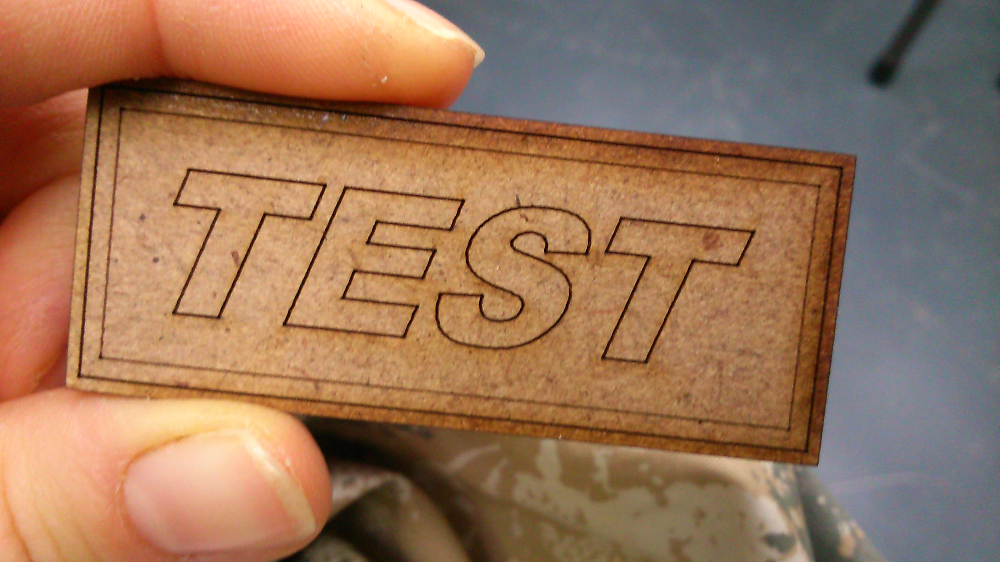
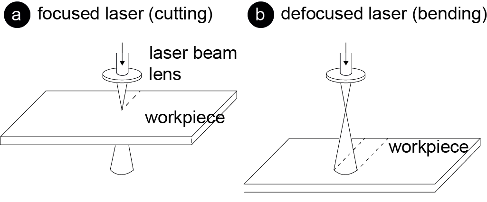
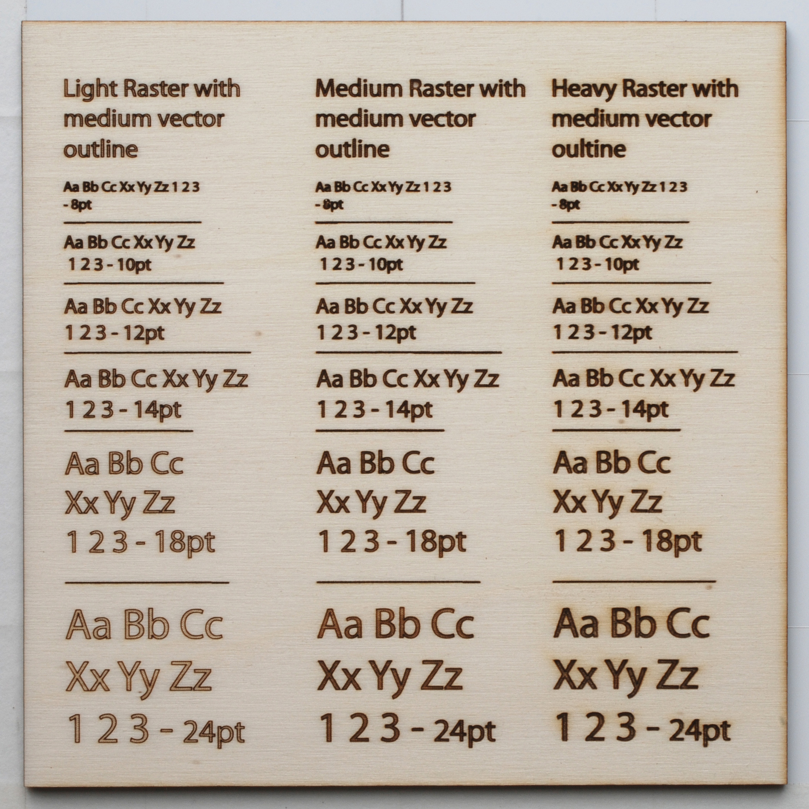

# Problematiche ricorrenti

### Il disegno appare sfocato
Il laser è fuori fuoco. Occorre ripetere la procedura di messa a fuoco.

### Il laser non è riuscito a tagliare il materiale
Le cause possono essere:

- La potenza non è abbastanza elevata per riuscire a tagliare il pezzo.
Ripetere l’operazione riducendo un po' la velocità.

- Il laser è fuori fuoco. 
Occorre ripetere la procedura di messa a fuoco.

 
 
### Nonostante la potenza elevata, il materiale non è stato tagliato
In questi casi sfruttare la funzione z-offset per sollevare leggermente il piano e permettere al raggio laser di penetrare più in profondità.

 
 
### L'incisione risulta poco marcata
- Sfruttare la funzione z-offset per lavorare fuori fuoco ottenendo linee più spesse del normale.
Per un risultato ottimale è raccomandato un valore di z-offset compreso tra +4 e +6mm.

### Incisione imperfetta
La presenza di doppie linee nel disegno può essere la causa di un disegno imperfetto.
Ciò può accadere anche incidendo del testo.
Per il testo, è preferibile utilizzare un “single line font” che consente di ottenere un’incisione più chiara e leggibile, specie se molto piccola.

 

