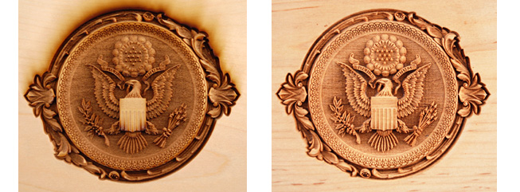
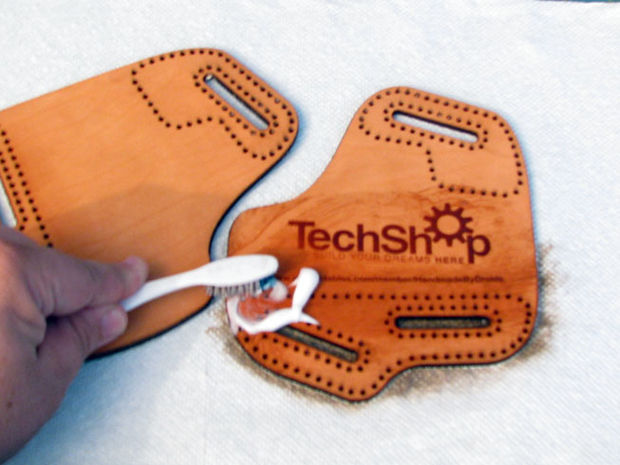

# Post produzione

## Eliminare i residui e ridurre le bruciature sui materiali organici
 
**Legno**

- Carteggiare leggermente la superficie bruciata con la carta vetrata 1000-500.
- Utilizzare un panno leggermente umido per eliminare i residui.
- Eliminare i residui della lavorazione con del [sapone per mani contenente pomice.](https://www.amazon.com/gp/product/B000FW4MD4/ref=s9_simi_gw_s0_p263_i1?pf_rd_m=ATVPDKIKX0DER&pf_rd_s=center-2&pf_rd_r=16F2MW6G7X2R62C0M0AF&pf_rd_t=101&pf_rd_p=470938631&pf_rd_i=507846)
 

 
**Pelle:**

- A seconda del tipo di pelle, strofinare con un panno morbido oppure leggermente inumidito con una goccia di detergente.
- Eliminare i residui della lavorazione con del [sapone per mani contenente pomice](https://www.amazon.com/gp/product/B000FW4MD4/ref=s9_simi_gw_s0_p263_i1?pf_rd_m=ATVPDKIKX0DER&pf_rd_s=center-2&pf_rd_r=16F2MW6G7X2R62C0M0AF&pf_rd_t=101&pf_rd_p=470938631&pf_rd_i=507846) utilizzando uno spazzolino.
 

 
**Eco pelle o pelle sintetica:**

Utilizzare del detergente per rimuovere facilmente le bruciature.