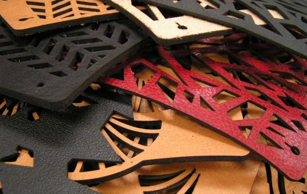

# Consigli e settaggi per le lavorazioni su vari materiali

### Essenze di legno

Utilizzare un legno privo di nodi e difetti con uno spessore regolare.
Scegliere l'essenza di legno in base alla lavorazione da effettuare.
I legni più teneri (e anche più economici): compensato di pioppo e abete
I legni più duri (più pregiati): ciliegio, pero, mogano, noce... 

**Lavorazione**

- Un trucco per evitare di annerire il materiale e le eventuali bruciature durante la lavorazione, è rivestire il compensato con del nastro adesivo, da rimuovere a lavorazione conclusa.

- Modulare la potenza in base all'effetto cercato e all'essenza di legno che stiamo utilizzando. 
Tenere a mente che ogni lavorazione prodotta su ogni tipo di essenza risulterà diversa.

 

- Per ottenre una incisione più marcata variare invece la messa a fuoco tramite il comando Z-offset.
 

### Acrilico

Con il laser a CO2 è possibile utilizzare sia acrilico estruso che colato.
Scegliere la tipologia di acrilico (e il colore) in funzione dell'effetto che vogliamo ricreare.
Ad esempio il raster su acrilico colato risulterà più bianco e definito di quello sull'acrilico estruso.

**Lavorazione**

- Per lavorare al meglio questo materiale, è opportuno non rimuovere la pellicola protettiva apposta su di esso fino all'estrazione del pezzo dal tavolo di lavoro.
- Prestare attenzione alla potenza. A prescindere dallo spessore, l'acrilico si taglia facilmente senza dover ricorrere ad una potenza molto elevata. 

### Carta

**Lavorazione**
Sia per il taglio che per l'incisione utilizzare una potenza molto bassa e una velocità molto elevata.
La carta è un materiale facilmente infiammabile e rischia di prendere fuoco facilmente.

- Nella realizzazione di maschere o cartonati, un consiglio è utilizzare la tecnica del tratteggio, ossia creare linee tratteggiate in corrispondenza delle pieghe. Il laser produrrà così piccoli tagli intervallati per facilitare la piegatura.

### Cartone

Scegliere il tipo di cartone in funzione di ciò che vogliamo realizzare.
Alcune tipologie di cartone sono più indicate per la costruzione di modelli 3D, come quelli da imballaggio, più spessi e dotati di doppia onda, mentre alcune più adatte al packaging. In questo caso si parla di cartone molto sottile, microondulato.

Tenere a mente che non è possibile utilizzare il cartone alveolare con la laser cutter, a meno di non volerlo solamente incidere.

**Lavorazione**

- Una tecnica per realizzare ad esempio una scatola, ottenendo pieghe nette e nessuna bruciatura, è incidere leggermente il retro del cartone con il laser e piegare in prossimità della linea creata utilizzando un righello. Per il taglio procedere nello stesso modo: incidere leggermente il retro aiutandosi con il taglierino.
- Prestare attenzione alla potenza. Il cartone è un materiale altamente infiammabile e se la potenza è molto alta rischia di prendere fuoco.

### Pelle e cuoio

Scegliere la pelle e posizionarla sul tavolo di lavoro.
Il taglio dovrà avvenire secondo l'orientamento delle venature.

**Lavorazione**

- Prestare attenzione alla potenza e ridurla il più possibile. Questi materiali si deformano e si anneriscono molto facilmente.

- Per un'incisione ottimale della pelle utilizzare attivare l'opzione Air Assist nel pannello lavorazioni e lavorare a 500PPI di risoluzione.
- Utilizzare la funzione Z-offset per defocalizzare il laser e produrre linee all'occorrenza più sottili.

### Vetro

Il consiglio è di utilizzare vetri colati, più economici e facili da incidere, a causa del minore contenuto di piombo, rispetto a quelli soffiati o ai cristalli. Oltre ad essere molto costosi infatti questi possono risultare molto fragili a causa delle tensioni all'interno del materiale che, durante il processo di incisione, possono determinare la rottura del vetro.

**Lavorazione**

- Per poter incidere il vetro correttamente e per evitare la rottura del pezzo è consigliato ricoprirlo con un foglio di carta bagnato, da rimuovere a fine lavorazione.
- Prestare attenzione alla potenza che deve essere ridotta al minimo.

### Alluminio anodizzato

L'alluminio anodizzato è un ottimo materiale da utilizzare per la lavorazione raster e la marcatura, adatta alla decorazione e personalizzazione di oggetti promozionali, targhette e smartphone. 
Il materiale si può trovare in molteplici colori, formati e spessori. 
Per quanto riguarda la lavorazione, aumentando la potenza è possibile produrre una colorazione diversa sul materiale che varia di intensità dal bianco al nero.

**Lavorazione**

- Un buon risultato si può ottenere impostando una elevata potenza di raster e una elevata velocià, usando una risoluzione di immagine a 500 PPI. 

### Ceramica

**Lavorazione**

- Prestare attenzione alla potenza che deve essere ridotta al minimo.

